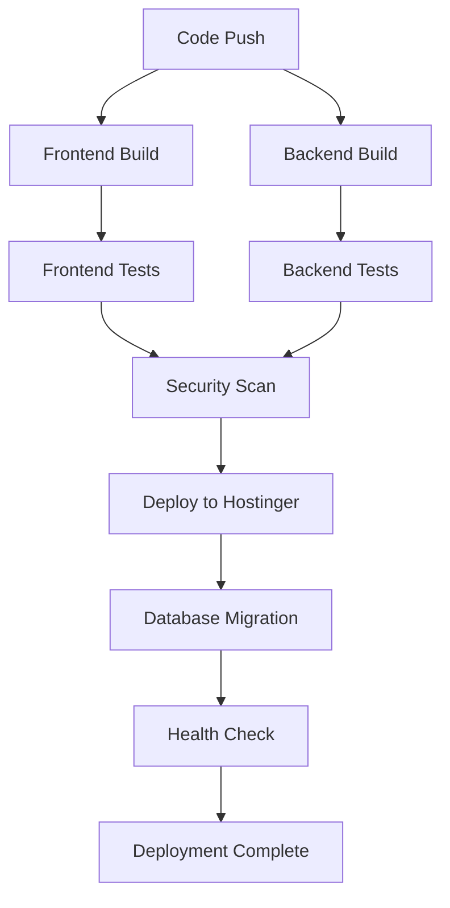

# 🚀 GenZFlow CI/CD Pipeline Setup Guide

## 📋 **Required GitHub Secrets**

You need to add these secrets to your GitHub repository:

### **1. Hostinger FTP Credentials**
- `HOSTINGER_FTP_HOST` - Your Hostinger FTP hostname
- `HOSTINGER_FTP_USERNAME` - Your Hostinger FTP username  
- `HOSTINGER_FTP_PASSWORD` - Your Hostinger FTP password

### **2. Database Credentials (Optional for Testing)**
- `MYSQL_HOST` - Database host (localhost)
- `MYSQL_USER` - Database username
- `MYSQL_PASSWORD` - Database password
- `MYSQL_DATABASE` - Database name

### **3. Security & Monitoring (Optional)**
- `SNYK_TOKEN` - Snyk security scanning token
- `CODECOV_TOKEN` - Code coverage reporting token

## 🔧 **How to Get Hostinger Credentials**

### **Step 1: Get FTP Credentials from Hostinger**

1. **Login to Hostinger Control Panel**
   - Go to: https://hpanel.hostinger.com
   - Login with your Hostinger account

2. **Navigate to FTP Accounts**
   - Go to "Advanced" → "FTP Accounts"
   - Or go to "Files" → "FTP Accounts"

3. **Create/Find FTP Account**
   - If you don't have one, create a new FTP account
   - Note down:
     - **FTP Host**: Usually your domain (genzflow.genzspace.in)
     - **Username**: Your FTP username
     - **Password**: Your FTP password
     - **Port**: Usually 21

### **Step 2: Get MySQL Credentials from Hostinger**

1. **Go to Databases Section**
   - In Hostinger control panel
   - Go to "Databases" → "MySQL Databases"

2. **Find Your Database**
   - Look for your 25GB MySQL database
   - Note down:
     - **Database Name**: (e.g., u123456789_genzflow)
     - **Username**: (e.g., u123456789_admin)
     - **Password**: Your MySQL password
     - **Host**: Usually localhost

## 🔐 **How to Add GitHub Secrets**

### **Step 1: Go to Repository Settings**
1. Go to your GitHub repository: https://github.com/Sadhu2005/GenZFlow
2. Click on "Settings" tab
3. Click on "Secrets and variables" → "Actions"

### **Step 2: Add Each Secret**
Click "New repository secret" and add:

```
Name: HOSTINGER_FTP_HOST
Value: genzflow.genzspace.in

Name: HOSTINGER_FTP_USERNAME  
Value: your_ftp_username

Name: HOSTINGER_FTP_PASSWORD
Value: your_ftp_password

Name: MYSQL_HOST
Value: localhost

Name: MYSQL_USER
Value: your_mysql_username

Name: MYSQL_PASSWORD
Value: your_mysql_password

Name: MYSQL_DATABASE
Value: your_database_name
```

## 🚀 **CI/CD Pipeline Features**

### **1. Automatic Deployment**
- ✅ **Frontend**: Auto-builds and deploys to Hostinger
- ✅ **Backend**: Auto-deploys Node.js app to Hostinger
- ✅ **Database**: Auto-imports schema (manual verification needed)
- ✅ **Health Checks**: Verifies deployment success

### **2. Testing Pipeline**
- ✅ **Frontend Tests**: React component testing
- ✅ **Backend Tests**: API endpoint testing
- ✅ **Security Scans**: Vulnerability scanning
- ✅ **Code Coverage**: Test coverage reporting

### **3. Security Pipeline**
- ✅ **Dependency Scanning**: npm audit
- ✅ **Vulnerability Scanning**: Trivy scanner
- ✅ **Secret Detection**: TruffleHog scanner
- ✅ **Weekly Security Scans**: Automated security checks

### **4. Database Management**
- ✅ **Schema Migration**: Auto-import database schema
- ✅ **Data Migration**: Handle data updates
- ✅ **Rollback Support**: Revert database changes
- ✅ **Verification**: Confirm migration success

## 📊 **Pipeline Workflow**



## 🔧 **Manual Setup Steps**

### **1. Enable GitHub Actions**
- Go to repository "Actions" tab
- Click "I understand my workflows, go ahead and enable them"

### **2. Configure Hostinger**
- Enable Node.js in Hostinger control panel
- Set Node.js version to 18.x
- Configure startup file as `server.js`

### **3. Database Setup**
- Import `backend/database/schema.sql` via phpMyAdmin
- Verify all tables are created
- Test database connection

## 🎯 **Deployment Triggers**

### **Automatic Deployment**
- ✅ **Push to main branch**: Full deployment
- ✅ **Pull Request**: Test only (no deployment)
- ✅ **Manual trigger**: Workflow dispatch

### **Manual Deployment**
- Go to "Actions" tab
- Click "Deploy to Hostinger"
- Click "Run workflow"

## 📈 **Monitoring & Alerts**

### **Success Notifications**
- ✅ **Deployment Success**: GitHub notification
- ✅ **Health Check Pass**: API accessible
- ✅ **Database Connected**: Schema imported

### **Failure Alerts**
- ❌ **Build Failure**: Check logs in Actions tab
- ❌ **Deployment Failure**: Check FTP credentials
- ❌ **Database Error**: Check MySQL credentials

## 🛠️ **Troubleshooting**

### **Common Issues**

1. **FTP Connection Failed**
   - Check FTP credentials in GitHub secrets
   - Verify Hostinger FTP is enabled
   - Check firewall settings

2. **Database Connection Failed**
   - Verify MySQL credentials
   - Check database exists in Hostinger
   - Import schema manually if needed

3. **Node.js Not Working**
   - Enable Node.js in Hostinger
   - Set correct Node.js version
   - Check startup file configuration

### **Debug Steps**
1. Check GitHub Actions logs
2. Verify all secrets are set correctly
3. Test FTP connection manually
4. Test database connection manually
5. Check Hostinger control panel settings

## 🎉 **Success Indicators**

When everything is working, you'll see:
- ✅ **Green checkmarks** in GitHub Actions
- ✅ **Frontend accessible** at https://genzflow.genzspace.in
- ✅ **Backend API responding** at https://genzflow.genzspace.in:5000
- ✅ **Database connected** and schema imported
- ✅ **All tests passing** in CI pipeline

Your **GenZFlow** platform will be fully automated with CI/CD! 🌊✨
